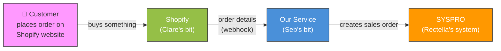
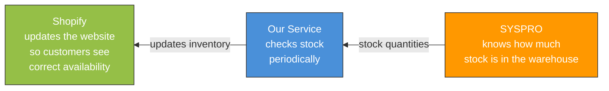

# Bar-Be-Quick Online Orders — The Big Picture

## How It All Connects



**That's it.** Customer buys → Shopify tells our service → our service puts it into SYSPRO.

---

## Stock Levels (the other direction)



This runs automatically in the background. No one needs to do anything.

---

## Deals & Pricing


Shopify is in charge of all pricing. Whatever the customer pays is what goes into SYSPRO. Simple.

---

## Who Does What

| Area | Who | Status |
|------|-----|--------|
| Shopify store, products, pricing, deals | **Clare** | In progress |
| Shopify app + webhook setup | **Clare** (with Seb's help) | Not yet |
| The service that moves data between systems | **Seb** | Built |
| SYSPRO config + user permissions | **Sarah** | In progress |
| Servers, VPN, network | **Ross / NCS** | In progress |
| Azure hosting (where our service lives) | **Seb** | Not yet |

---

## What Clare Needs To Do

### Now
- Make sure the **13 products have SKUs** in Shopify
- SKUs must **exactly match** the stock codes in SYSPRO
- Set up **deals and discounts** however she likes — all in Shopify

### When Seb Says "Ready"
- Create a **Shopify app** (gives us the keys to connect)
- The app needs these permissions: **Orders** (read), **Inventory** (read + write)
- We need the **access token** from the app (starts with `shpat_...`)
- Set up **one webhook** — "orders/create" — pointed at our service
- Seb will walk through this with her, takes about 10 minutes

### Product Settings (important for stock sync)
- All 13 products must have **"Track inventory"** turned ON
- **"Continue selling when out of stock"** must be OFF
- This ensures products show "Sold out" when stock hits zero

### Never
- Anything to do with SYSPRO, VPN, or servers — not her problem

---

## One Page Summary

```
    SHOPIFY (Clare)          OUR SERVICE (Seb)           SYSPRO (Rectella)
   ┌──────────────┐        ┌──────────────────┐        ┌──────────────────┐
   │              │        │                  │        │                  │
   │  Products    │ orders │  Grabs orders    │ sales  │  Warehouse       │
   │  Pricing     │───────>│  Checks them     │──────> │  picks & ships   │
   │  Deals       │        │  Sends to SYSPRO │ order  │                  │
   │              │        │                  │        │                  │
   │              │ stock  │  Checks stock    │ stock  │                  │
   │  Shows       │<───────│  levels          │<────── │  Knows what's    │
   │  availability│        │  periodically    │        │  in stock        │
   │              │        │                  │        │                  │
   └──────────────┘        └──────────────────┘        └──────────────────┘
```
