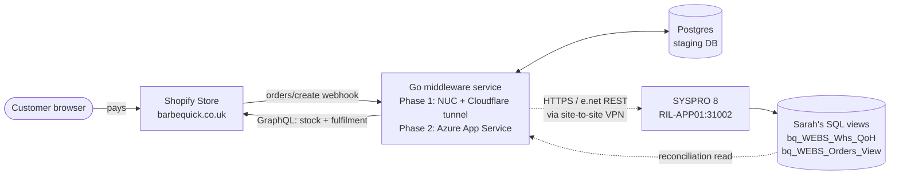
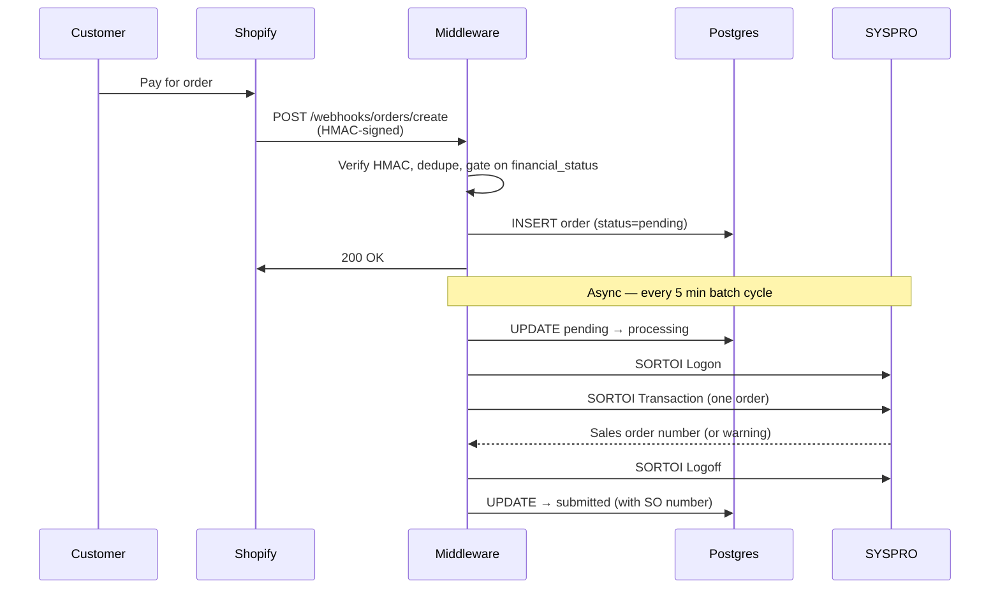
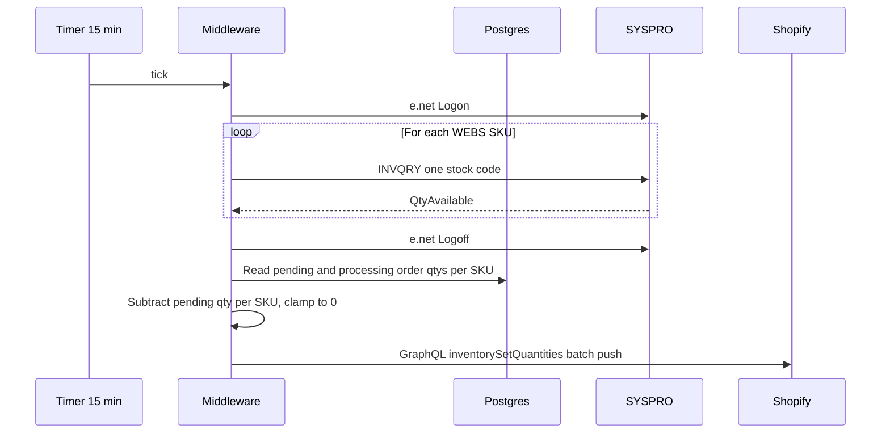
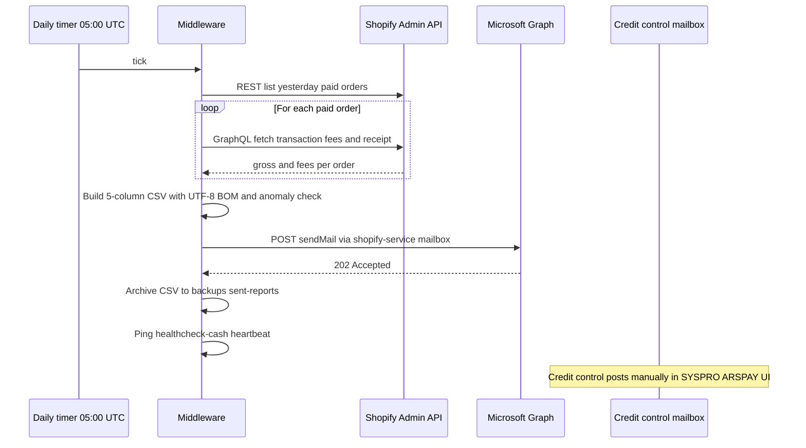

# Rectella Shopify Service — Handover Document

**Project:** Shopify ↔ SYSPRO 8 integration for Barbequick (`barbequick.co.uk`)
**Delivered by:** Ctrl Alt Insight (Sarah Adamo, Sebastian Adamo)
**For:** Rectella International — Operations (Melanie Higgins, Reece Taylor), Finance (Liz Buckley), and IT (Andrew Charlesworth, NCS)
**Status:** Phase 1 LIVE on bridge infrastructure, processing real customer orders. Phase 2 cloud migration in progress.

---

## 1. What we built

A middleware service that sits between the Barbequick Shopify storefront and SYSPRO 8 ERP, automating three previously-manual workflows:

| # | Topic | Direction | Trigger | Business object |
|---|-------|-----------|---------|-----------------|
| 1 | **Order entry** | Shopify → SYSPRO | Webhook on customer payment | `SORTOI` |
| 2 | **Quantity on hand** | SYSPRO → Shopify | Polled every 15 minutes | `INVQRY` |
| 3 | **Cash receipts** | Shopify → credit control | Daily email at **06:00 UK time** in summer (cron `0 5 * * *` UTC; 05:00 GMT in winter — see §12.3 for DST) | (manual posting in SYSPRO ARSPAY UI) |

A fourth flow (**fulfilment back**: SYSPRO `SORQRY` → Shopify shipped status, every 30 minutes) is also live but is largely a by-product of the first three.

> **What's normal:** an order can take up to **5 minutes** to appear in SYSPRO after the customer pays — the service batches submissions on a 5-minute cycle. Stock figures on the storefront refresh every **15 minutes**. If you see Shopify ahead of SYSPRO inside those windows, that's expected — don't escalate.
>
> **Stock-sync footnote:** SKUs not present in the SYSPRO `WEBS` warehouse are pushed as **0** to Shopify (Sarah's rule — prevents accidental sale of stock Rectella doesn't carry). See §4.2.

---

## 2. High-level architecture



*Hosting note: Phase 1 runs the middleware on a hardened on-prem NUC reached through a Cloudflare named tunnel (`rectella.ctrlaltinsight.co.uk`). Phase 2 migrates the same code to Azure App Service. The data-flow shape stays identical.*

**Key design choices:**

- **Stage-then-process**: every Shopify webhook lands in Postgres first. SYSPRO is only ever called by an asynchronous batch worker. If SYSPRO is unreachable, orders queue safely until the VPN is back.
- **Single SYSPRO customer**: every order posts to `WEBS01`. No per-customer accounts.
- **Single warehouse**: stock and fulfilment use `WEBS` only.
- **Shopify owns pricing**: SYSPRO prices are not synced to Shopify. The middleware honours whatever the customer paid (net of VAT — see §6).
- **Idempotent at every boundary**: webhooks are deduplicated on Shopify's `X-Shopify-Webhook-Id`; SYSPRO orders are deduplicated on Shopify order ID; cash receipts are deduplicated on Shopify transaction ID.

---

## 3. Topic 1 — Order entry (Shopify → SYSPRO)

### 3.1 Flow



### 3.2 What gets sent to SYSPRO

For each Shopify order, one `SORTOI` transaction containing:

| SYSPRO field | Shopify source | Notes |
|--------------|---------------|-------|
| `Customer` | (fixed) `WEBS01` | Single web-sales account |
| `CustomerPoNumber` | `order.name` (e.g. `#BBQ1010`) | **The cross-match key** between Shopify and SYSPRO |
| `OrderDate`, `RequestedShipDate` | `created_at` | RFC3339. **Phase 2 review:** `RequestedShipDate = OrderDate` is a Phase 1 simplification; warehouse may want a lead-time offset (e.g. order date + 1 working day). Discuss with Melanie/Reece. |
| `ShipAddress1..5`, `ShipPostalCode` | `shipping_address.*` | Truncated to SYSPRO XSD limits (40/15 chars) |
| `StockCode` | `line_items[].sku` | Must exactly match a SYSPRO stock code |
| `OrderQty` | `line_items[].quantity` | |
| `Price` | `line_items[].price` minus per-line tax | **Net of VAT** (see §6) |
| `StockTaxCode` | derived from `tax_lines[].rate` | `A` (20%) / `B` (5%) / `Z` (0%) |
| `FreightValue`, `FreightCost` | `shipping_lines[].price` minus tax | Net of shipping VAT |

### 3.3 Order statuses (in our DB)

```
pending    → in queue, waiting for the next 5-minute batch
processing → batch in flight to SYSPRO (atomic transition prevents double-submit)
submitted  → SYSPRO accepted, sales order number recorded
failed     → SYSPRO rejected (business error, e.g. invalid SKU)
dead_letter→ 3+ infrastructure failures (escalate)
fulfilled  → SYSPRO marked complete, Shopify fulfilment created
cancelled  → cancelled by Shopify (Phase 2 will propagate to SYSPRO)
```

### 3.4 Failure handling

- **Business errors** (bad SKU, missing customer): order marked `failed`, batch continues with the next order.
- **Infrastructure errors** (VPN down, SYSPRO 5xx): batch aborts cleanly, retries next cycle. After 3 infrastructure failures the order moves to `dead_letter`.
- **Crash during submit**: a startup sweep flips orders stuck in `processing` for >10 minutes back to `pending`.
- **Missed webhook**: a reconciliation sweeper polls Shopify Admin REST every 15 minutes (48 h lookback) and re-stages anything that exists in Shopify but not in our DB.

---

## 4. Topic 2 — Quantity on hand (SYSPRO → Shopify)

### 4.1 Flow



### 4.2 Behaviour rules

- **Order-aware**: pending and processing orders are subtracted from SYSPRO `QtyAvailable` before pushing to Shopify, so the same unit isn't oversold while it's in transit to SYSPRO.
- **Negative clamp**: if pending orders exceed SYSPRO availability, Shopify is set to 0 (never negative).
- **Zero-push rule** (Sarah's rule): if a SKU is **not** present on the WEBS warehouse in SYSPRO, Shopify is set to 0. This prevents accidentally selling something Rectella doesn't stock.
- **Failure-safe**: if SYSPRO is unreachable, Shopify is **not** zeroed. Last-known levels stay on the storefront.
- **Webhook-triggered sync**: every order also fires a 2-second debounced sync, so heavy buying activity doesn't depend on the 15-minute timer.

### 4.3 SKU discovery

Lister precedence (first one configured wins):

1. **SQL Server view** (`bq_WEBS_Whs_QoH` on RIL-DB01) — Sarah's curated list. Currently blocked on RIL-DB01 credentials for the service account.
2. **Shopify GraphQL** — paginated `productVariants` query — every variant SKU on the live store.
3. **Static slice** — `SYSPRO_SKUS` env var, comma-separated.

---

## 5. Topic 3 — Cash receipts (daily report to credit control)

### 5.1 Agreed approach (per Sarah, 2026-04-17; Graph mailer live 2026-04-25)

Cash receipts are handled by a **daily email** to Rectella's credit control mailbox at **06:00 UK time**, containing the prior day's settled Shopify transactions as a CSV. Credit control posts the receipts manually in SYSPRO (Sales / AR → ARSPAY) against the WEBS01 customer account, using the Shopify order reference as the payment reference.

A **second daily email at 06:00 UK** — the **order-intake summary** — was added on top of the cash-receipt feed: HTML breakdown of yesterday's order count, gross total, status mix, and a "stuck-rows" anomaly count (BBQ1026 fingerprint), plus a per-order CSV attachment. Goes to ops/finance recipients via `ORDER_INTAKE_TO`.

Both reports use **Microsoft Graph `sendMail`** via the dedicated service mailbox `shopify-service@rectella.com` (NCS provisioned 2026-04-23). Auth is client-credentials OAuth against the Entra app registration "SysPro Shopify Graph API App" (`Mail.Send` application permission, `ApplicationAccessPolicy` scoped to that one mailbox — the app cannot send from anywhere else).

> **Phase 2 note:** automated posting via SYSPRO's AR cash-receipt business object (`ARSTPY`) is **not viable on Rectella's current SYSPRO licence** — the business object is not registered in this environment. We will investigate full automation in **Phase 2 once Rectella has moved to the new licensing model** that includes the AR transaction posting business objects.

### 5.2 Flow



On send failure (Graph 5xx, 401 after retry, network blip): the CSV is written to `~/backups/rectella/missed-reports/YYYY-MM-DD-cash.csv`, an ntfy push fires to the operator with the file path, the heartbeat is **not** sent (Healthchecks.io grace window expires → secondary ntfy alert). Operator re-sends with `cmd/send-report --type=cash --date=YYYY-MM-DD`.

### 5.3 CSV format (per Sarah, 2026-04-17, updated 2026-04-25)

Five columns, one row per settled Shopify transaction for the prior calendar day (UTC). Currency values prefixed with `£`.

| Column | Meaning |
|--------|---------|
| `Customer (SYSPRO)` | Always `WEBS01` — the SYSPRO customer account every Shopify order posts against. Saves credit control looking it up. |
| `Shopify Reference` | Shopify order name (e.g. `#BBQ1001`) — use as payment reference in SYSPRO ARSPAY UI |
| `Order Value` | Gross — what the customer paid (post into the `Amount` field) |
| `Charges` | Bank / Stripe / PayPal fee (post into the `Bank charges` field) — see §5.5 for which gateway returns what |
| `Receipt Value` | Order Value − Charges — the figure that hits the cashbook |

**Example row:** `WEBS01,#BBQ1001,£8.00,£1.12,£6.88`

The email body also summarises gross/fee/net/count in plain text so credit control can sanity-check totals without opening the attachment, and explicitly states "Post against SYSPRO customer: WEBS01" so the destination account is unambiguous.

**Zero-order days**: an email is sent every day, even if zero Shopify transactions were paid the prior day. The body says explicitly _"No paid Shopify transactions for this date — this email confirms the daily process ran successfully"_ so credit control knows the absence is intentional, not a system failure.

**Range / backfill report** (`cmd/send-report --type=cash --from=YYYY-MM-DD --to=YYYY-MM-DD`): adds a leading `Date` column so multi-day rows are sortable. Same five trailing columns. Used for one-off operator sends (e.g. the credit-control cutover announcement on first launch).

### 5.4 Operating prerequisites

| Item | Owner | Notes |
|------|-------|-------|
| `GRAPH_TENANT_ID` | NCS (Andrew) | Rectella Entra tenant GUID. Static. |
| `GRAPH_CLIENT_ID` | NCS (Andrew) | App registration "SysPro Shopify Graph API App" client ID. Static. |
| `GRAPH_CLIENT_SECRET` | NCS (Andrew) | App secret. **Rotates** — see §10 secret-rotation playbook. |
| `GRAPH_SENDER_MAILBOX` | NCS (Andrew) | `shopify-service@rectella.com`. Locked by `ApplicationAccessPolicy`. |
| `CREDIT_CONTROL_TO` | Liz (owns recipient-list changes) | Comma-separated recipient list. **Live value: `creditcontrol@rectella.com`** — the shared credit-control mailbox. Liz is not on the distribution; she views the data from the team mailbox. |
| `ORDER_INTAKE_TO` | Liz / Ops (own recipient-list changes) | Comma-separated. **Live value: `creditcontrol@rectella.com`** — same shared mailbox as the cash report (per Liz, 2026-04-25). Disabled if unset. |
| `DAILY_REPORT_HOUR` / `ORDER_INTAKE_HOUR` | Operator | UTC hour 0–23. `5` = 06:00 UK BST. Bump to `6` after the Oct DST change. |
| `HEALTHCHECKS_CASH_URL`, `HEALTHCHECKS_INTAKE_URL` | Operator | Optional Healthchecks.io ping URLs — fires ntfy if a daily send doesn't happen. |
| `DEAD_LETTER_DIR`, `SENT_REPORT_ARCHIVE_DIR`, `REPORT_STATE_DIR` | Operator | Optional. Default to `~/backups/rectella/{missed-reports,sent-reports,state}/`. |
| `NTFY_TOPIC` | Operator | Push topic for dead-letter alerts. Reused from the existing pipeline-audit alerts. |

If any required `GRAPH_*` / recipient field is missing the daily reporter is disabled gracefully and a warning is logged — the service refuses to half-configure mail. The whole resilience layer (healthchecks, dead-letter, archive, state) degrades feature-by-feature when each var is absent.

### 5.5 How the fee field is sourced (gateway-by-gateway)

Rectella's Shopify uses two payment gateways, each with a different "fee" data path:

| Gateway | Where the fee lives | Notes |
|---------|--------------------|-------|
| **Shopify Payments** (cards) | GraphQL `transactions.fees[].amount` (NOT in REST `transactions.json`) | Returned per fee type — the daily report sums all `fees[]` entries and explicitly excludes `taxAmount` (VAT on the processing fee, owed to HMRC, separate accounting line). |
| **PayPal** | REST `transactions.json` → `receipt.fee_amount` (string, GBP major units) | GraphQL returns empty `fees[]` for PayPal — the code falls back to parsing `receiptJson` for `fee_amount`. |
| Manual / bank transfer / COD | No fee data | Logged at Debug, fee = 0 (legitimate, no fee was actually deducted). |

If a known card processor returns zero fee unexpectedly the service emits a `WARN` log _"fee extraction returned zero for known-paid gateway"_ — that's the silent-fail tripwire. Anomaly assertion (§8.1) also flags the email subject with `[⚠ ANOMALY]` if fees aggregate to zero across non-zero transactions.

### 5.6 Why not full automation in Phase 1

Two reasons:

1. **SYSPRO licensing**: the `ARSTPY` business object (the e.net DLL that posts AR cash receipts) is not present on Rectella's current SYSPRO install — calling it returns `e.net exception 100000`. This is a license-tier limitation, not a configuration bug. Adding the business object requires Rectella to upgrade their SYSPRO licence.
2. **Finance sign-off**: Liz needs to validate the GL routing (cashbook, bank-charges account) and posting cadence on real receipts before automation goes live, regardless of licensing. The daily report gives her exactly the data she needs to do that validation in parallel with everything else this Phase 1 launch is asking of her.

The daily report is the right Phase 1 design even with full licensing, because it lets Liz keep cash posting under human control while the integration earns trust.

### 5.7 Phase 2 — what changes when licensing is upgraded

When Rectella moves to a SYSPRO licence that includes the AR transaction business objects, Phase 2 swaps the "manual posting from CSV" step for an automated `ARSTPY` polling syncer that runs every 15 minutes, posts gross + bank charges per Shopify order, and uses the Shopify order name as the payment reference. The daily report can stay enabled in parallel as an audit trail.

The middleware codebase already contains the scaffolding (`internal/syspro/cash_receipt.go`, `internal/payments/syncer.go`, `cmd/arspaytest/`) for that Phase 2 path — gated behind `PAYMENTS_SYNC_INTERVAL` + `ARSPAY_CASH_BOOK` + `ARSPAY_PAYMENT_TYPE` env vars, all unset in Phase 1.

---

## 6. Pricing & VAT — assumptions baked in

The Barbequick storefront sells with `taxes_included = true` (UK B2C standard — prices on the website are gross). SYSPRO 8 expects net prices, so the middleware:

1. **Subtracts the absolute per-line tax amount** Shopify provides in `line_items[].tax_lines[].price` from the gross line price. We do **not** divide by a rate — the absolute subtraction matches Shopify's own rounding to the penny.
2. **Sets `<StockTaxCode>` per line** based on `tax_lines[].rate`:
   - `0.20` → `A` (UK standard 20%)
   - `0.05` → `B` (reduced 5% — domestic fuel)
   - `0.00` → `Z` (zero-rated)
3. **Treats freight identically**: `<FreightValue>` is net of shipping VAT.

This requires **"Allow changes to tax code for stocked items"** to be enabled in SYSPRO Sales Order Setup → Tax/Um tab. Sarah enabled this on the live `RIL` company.

If the storefront is ever switched to `taxes_included = false` (exclusive pricing), the middleware leaves prices untouched. No code change required.

---

## 7. Other operating assumptions

| # | Assumption | Why it matters |
|---|------------|----------------|
| 1 | Stock sync polls every **15 minutes** | Tunable via `STOCK_SYNC_INTERVAL`. A live order also fires a 2-second debounced sync, so 15 min is a safety net not a deadline. |
| 2 | Order batch cycle every **5 minutes** | Orders sit in `pending` for ≤5 min before reaching SYSPRO. Tunable via `BATCH_INTERVAL`. |
| 3 | Fulfilment poll every **30 minutes** | Tunable via `FULFILMENT_SYNC_INTERVAL`. Customer-facing impact is the dispatch email timing. |
| 4 | Reconciliation sweep every **15 minutes**, **48 h lookback** | Catches missed webhooks. First sweep runs immediately on service restart. |
| 5 | Single SYSPRO operator account | SYSPRO allows only one session per operator. The service uses a mutex internally so its sub-systems share one session. **A human logging in with the same operator will evict the service.** Reece is creating a dedicated operator account. |
| 6 | Single warehouse `WEBS`, single customer `WEBS01` | Hardcoded — multi-warehouse is out of scope. |
| 7 | UK GBP only | No multi-currency logic. |
| 8 | Refunds posted manually | The service does not write refunds back to SYSPRO. |
| 9 | Gift cards disabled on Shopify | Pending Liz sign-off on the non-stocked-line + GL liability approach. |
| 10 | Cancellation classify-only (Phase 1) | Cancelled Shopify orders are categorised but **not** propagated to SYSPRO automatically. Operator follow-up required. |

---

## 8. What happens when something stops working

Detailed playbooks live in [`docs/runbook.md`](runbook.md). The summary view:

| Symptom | Customer impact | Recovery path |
|---------|-----------------|---------------|
| **VPN tunnel down** | None initially. Orders queue in Postgres. | NCS restores tunnel; batch processor drains queue automatically within one cycle. |
| **SYSPRO down / unreachable** | Same as above. | Same as above. |
| **Shopify webhook not delivered** | Order missing from SYSPRO. | Reconciliation sweeper picks it up within 15 min (48 h lookback). Restart forces an immediate sweep. |
| **Service crashes mid-submit** | Order may show `processing` indefinitely. | Startup sweep flips `processing` >10 min back to `pending`. |
| **Postgres down** | Webhooks rejected with 5xx; Shopify retries for 48 h. | Restore Postgres; Shopify retry cycle covers the gap. |
| **Wrong webhook secret** | All webhooks 401. | Update `SHOPIFY_WEBHOOK_SECRET`; Shopify retries within 48 h. |
| **Stock figures wrong on storefront** | Possible oversell of one or two units between cycles. | Next 15-min cycle corrects it; or trigger immediately by placing any order. |
| **SYSPRO operator session evicted by human login** | Batch and stock-sync errors until next cycle. | Either: human logs out, or service waits ≤5 min and retries. Reece's dedicated operator account eliminates this. |
| **Daily report didn't arrive** | Credit control / ops missing the morning summary in the shared mailbox. | Healthchecks.io grace-window alert fires ntfy push at ~06:30 UK. Operator runs `cmd/send-report --type=cash --date=YYYY-MM-DD` to force-resend. If `~/backups/rectella/missed-reports/` has the CSV, attach it manually instead. |
| **Daily report subject has `[⚠ ANOMALY]`** | Email arrived but the data may be wrong. | Cross-check the figures against Shopify Finances → Payouts. Common causes: Shopify API field renamed (zero fees), webhook flow broke (zero orders weekday), batch processor writeback broke (BBQ1026 fingerprint — all orders stuck in `submitted` with empty SYSPRO number). Page Ctrl Alt Insight (Tier 2). |
| **Graph mailer auth broke (e.g. NCS rotated the secret)** | Boot log shows `Graph mailer verification failed at boot`; daily sends will dead-letter. | Get new secret from NCS, edit `<dotenv>`, restart. See §10 secret-rotation playbook. |

### 8.1 Monitoring layers in place

The daily-report subsystem has four independent failure-detection layers, deliberately overlapping so no single one is load-bearing:

1. **Boot-time Graph verify** — at service startup, the mailer hits `GET /users/{mailbox}` to confirm tenant + client + secret + mailbox are all wired. On failure, `slog.Warn` in the journal. Does NOT block scheduler start (tokens expire after 1 h anyway — boot success doesn't guarantee 06:00 success). Catches typos and revoked policies immediately.

2. **Row-level data-sanity assertions** — before each send, the report is screened for impossible-looking shapes:
   - Cash report: non-empty txns + zero summed fees → `[⚠ ANOMALY]` banner. (This is the £0-fees-for-10-days bug fingerprint.)
   - Intake report: zero orders on a weekday → banner. All payment_amount=0 → banner. All orders in `submitted` with no SYSPRO number → banner.
   The email still sends — credit control still has the data — but the subject line warns the recipient not to act on it without cross-checking.

3. **Healthchecks.io heartbeat** — after each successful send, the reporter pings `HEALTHCHECKS_CASH_URL` / `HEALTHCHECKS_INTAKE_URL`. If a ping doesn't arrive within Healthchecks' grace window (set to 30 min past the scheduled send), Healthchecks emails / pushes ntfy. This is the "did it fire today?" signal that the operator gets without checking the journal.

4. **Disk dead-letter + ntfy push** — if `mailer.Send` returns an error (auth, network, 5xx), the CSV is written to `~/backups/rectella/missed-reports/YYYY-MM-DD-{cash|intake}.csv` and an ntfy push fires to the operator with the file path. Combined with #3, this turns a delivery failure from "silent loss" into "operator paged with the file in hand".

Plus a **sent-CSV archive** (`~/backups/rectella/sent-reports/`) on every successful send — audit trail independent of the recipient's mailbox. If anyone in credit control deletes an email, finance can still reconcile against the original artifact.

### 8.2 Order-pipeline + stock-sync event push (lightweight observability)

Two more ntfy events fire as low-priority background pushes (not pager wake-ups) so the operator can see operational issues *the moment they happen* rather than wait for the next 06:00 intake email:

- **Order rejected by SYSPRO** (status → `failed`) — body names the order number, the SYSPRO reason, and the retry endpoint. Typical cause: bad SKU, missing customer, malformed address.
- **Order dead-lettered** (status → `dead_letter` after 3 consecutive infra failures) — body names the order number, attempt count, last error, and the retry endpoint. Typical cause: VPN/SYSPRO down for the whole batch window.
- **Orphan SKUs found in stock sync** — Shopify SKUs with no matching record in the SYSPRO `WEBS` warehouse. Body names the count and a sample of up to 5 codes. Rate-limited to one push per hour and only when the orphan set changes, so a persistent unmatched SKU doesn't pager-flood.

All three reuse `NTFY_TOPIC` and are gated on it — empty topic = silent fall-back to journal-only logging (no behaviour change vs the original Phase 1 build).

These events are **observability, not full hardening** — they let the operator (Sebastian during the 4-week post-handoff care window; NCS thereafter) see when something's drifting without yet committing to an automated retry/recovery path. If events fire often enough to suggest a systemic issue, the right response is targeted code hardening — not muting the events.

The full per-incident triage steps (commands to run, what to look for in logs, who to escalate to) live in the runbook.

---

## 9. Reconciliation report (Phase 1, in progress)

> **Status:** Specified. Not yet built. **Blocked on Sarah's `bq_WEBS_Orders_View` SQL Server view on RIL-DB01** (NCS to grant the service account read on the view once it exists). Estimated build effort: half a day from view-availability. Tool will ship as `cmd/intake-report/` and write CSV (optionally email).

This is the weekly (and on-demand) assurance report Finance and Operations run to **prove** the integration is whole — every paid Shopify order has a matching SYSPRO sales order, with totals reconciling to within the expected VAT delta. Originally scoped from Sarah's Phase 0 offer (*"I can create a view for the SYSPRO side if that helps"*), now a Phase 1 deliverable on the path to full sign-off.

### 9.1 What the report compares

For a chosen date range, three datasets:

1. **Shopify** — orders with `financial_status` in (`paid`, `partially_paid`).
2. **Middleware DB** — orders with status in (`submitted`, `fulfilled`).
3. **SYSPRO** — sales orders against `WEBS01`, joined on `CustomerPoNumber` (which equals the Shopify `order.name`, e.g. `#BBQ1010`).

### 9.2 Suggested SYSPRO view shape

What the middleware needs from Sarah's view (call it e.g. `bq_WEBS_Orders_View`):

| Column | Type | Source |
|--------|------|--------|
| `SalesOrder` | string | `SorMaster.SalesOrder` |
| `CustomerPoNumber` | string | `SorMaster.CustomerPoNumber` (this is `#BBQXXXX`) |
| `Customer` | string | `SorMaster.Customer` (always `WEBS01`) |
| `OrderDate` | datetime | `SorMaster.OrderDate` |
| `OrderStatus` | char | `SorMaster.OrderStatus` (1–9 SYSPRO state) |
| `OrderValueGross` | decimal | `SorMaster.OrderValueGross` |
| `OrderValueTax` | decimal | `SorMaster.OrderValueTax` |
| `LineCount` | int | count from `SorDetail` |
| `WarehouseCode` | string | `SorDetail.Warehouse` (always `WEBS` — useful for sanity) |

Filter to `WHERE Customer = 'WEBS01' AND CustomerPoNumber LIKE '#BBQ%'`. SQL Server view (live SQL) is preferred over a SYSPRO custom form export.

### 9.3 Output (per row)

| Shopify ref | Date | Shopify total | SYSPRO total | SYSPRO SO# | Match status |
|-------------|------|---------------|--------------|------------|--------------|
| `#BBQ1010` | 2026-04-17 | £119.99 | £99.99 | 015575 | ✅ matched (totals net of VAT differ as expected) |
| `#BBQ1011` | 2026-04-17 | £45.00 | — | — | ❌ **MISSING IN SYSPRO** |
| `#BBQ1012` | 2026-04-17 | — | £200.00 | 015576 | ⚠️ **MISSING IN SHOPIFY** (test order?) |

### 9.4 Implementation note

A CLI tool ships in `cmd/intake-report/` — single command that takes a date range, queries all three sources, writes a CSV (and optionally emails it). Estimated effort: half a day once Sarah's view is in place.

### 9.5 Operating model

| Aspect | Detail |
|---|---|
| **Cadence** | Weekly (every Monday morning, covering the prior 7 days). Operator can also run on-demand for any disputed transaction or after an incident. |
| **Trigger** | `go run ./cmd/intake-report --from=YYYY-MM-DD --to=YYYY-MM-DD [--email]`. Optional cron once the weekly cadence is bedded in. |
| **Output** | CSV at `~/backups/rectella/reconciliation/YYYY-MM-DD-recon.csv` (sent-archive shape, mirrors the daily-report `sent-reports/` layout). With `--email`, also goes to `CREDIT_CONTROL_TO` / `ORDER_INTAKE_TO`. |
| **Anomaly threshold** | Any `MISSING IN SYSPRO` or `MISSING IN SHOPIFY` row, OR a row where Shopify-net vs SYSPRO total differs by more than £1.00 after VAT strip → ntfy push to operator (mirrors the daily-report dead-letter pattern). Sub-£1 differences are logged but not paged. |
| **Failure mode** | If the SYSPRO view is unreachable (VPN / RIL-DB01 down), the tool writes a partial CSV with the SYSPRO column blank and a header banner — never silently zero. |
| **Owner of action** | Liz (Finance) reviews and signs off the weekly run during Phase 1 stabilisation. Sarah triages SYSPRO-side mismatches; Sebastian triages middleware/Shopify-side mismatches. |

---

## 10. Operating handover

| Item | Where to find it |
|------|------------------|
| Day-to-day operator runbook | [`docs/runbook.md`](runbook.md) — *note: incident commands in the runbook are written for the Phase 2 Azure deployment (`az webapp …`); during Phase 1 on the NUC, the equivalents are `systemctl --user restart rectella` to restart, `journalctl --user -u rectella -f` to tail logs, and `~/backups/rectella/` for pg_dumps. A Phase 1 refresh of the runbook is queued.* |
| Architecture diagrams (interactive) | [`docs/architecture-playground.html`](architecture-playground.html) |
| Architecture diagrams (durable ASCII) | [`docs/architecture-diagrams.md`](architecture-diagrams.md) |
| Network setup (VPN, firewalls, hosts) | [`docs/network-setup.md`](network-setup.md) |
| SYSPRO config requirements (per-line tax codes etc.) | [`docs/SYSPRO 8 SORTOI Per-Line Tax Code Override.md`](SYSPRO%208%20SORTOI%20Per-Line%20Tax%20Code%20Override.md) |

### Escalation contacts

| Role | Name | Email |
|------|------|-------|
| Developer | Sebastian Adamo (Ctrl Alt Insight) | sebastian@ctrlaltinsight.co.uk |
| SYSPRO consultant | Sarah Adamo (Ctrl Alt Insight) | sarah@ctrlaltinsight.co.uk |
| SYSPRO admin (Rectella) | Melanie Higgins | higginsm@rectella.com |
| SYSPRO admin (Rectella) | Reece Taylor | taylorr@rectella.com |
| Finance Director (Rectella) | Liz Buckley | buckleyl@rectella.com |
| Managed IT — Entra / M365 / Graph app | NCS (Andrew Charlesworth) | helpdesk@ncs.cloud |
| Managed IT — VPN / network / infra | NCS (Ross Tomlinson) | helpdesk@ncs.cloud |

### 10.1 Tier 1 (NCS / Rectella ops) vs Tier 2 (Ctrl Alt Insight) split

Realistic post-handoff support model. Rectella has no in-house developers, so a clean break-and-walk-away is fiction — these are the responsibilities each side owns:

**Tier 1 — NCS / Rectella ops** (covered by their existing managed-IT contract):

- Restart the service (`systemctl --user restart rectella`)
- Rotate the Microsoft Graph client secret in `<dotenv>` when it expires (see §10.2)
- Respond to ntfy push notifications for dead-letter alerts (topic configured in `NTFY_TOPIC` env var; subscribed device(s) at NCS / Rectella's choice — see runbook for ntfy-app setup. The current topic also fans out to Sebastian's phone during the warranty period.)
- Force-resend a missed daily report via `cmd/send-report --type=cash --date=YYYY-MM-DD`
- Restore Postgres from `~/backups/rectella/` if the NUC dies
- Manage the VPN tunnel and Cloudflare tunnel
- Liaise with Liz on recipient-list changes (`CREDIT_CONTROL_TO`, `ORDER_INTAKE_TO`)

**Tier 2 — Ctrl Alt Insight (Sebastian)** (commercial retainer or pay-per-incident):

- Code bugs, schema changes, Shopify / SYSPRO API drift
- Anomaly-banner investigations (e.g. "report shows £0 fees again")
- New report formats, additional integrations
- Performance issues, observability changes
- Phase 2+ feature work (cancellation propagation, gift cards, ARSPAY automation)

If a Tier 1 incident escalates beyond the runbook's scope, NCS pages Sebastian via the email/Slack channel agreed in the support contract.

### 10.2 Microsoft Graph secret rotation playbook

The Graph client secret in `<dotenv>` (`GRAPH_CLIENT_SECRET`) expires periodically. Entra app-registration secrets default to 6 / 12 / 24 month TTL depending on tenant policy.

**Recommended:** add a calendar reminder 14 days before expiry. NCS owns the app registration ("SysPro Shopify Graph API App", client ID `8a99b519-690c-461c-a4ce-5dd8dd8ea77f`, tenant `b6107a6e-ee35-4cfc-916a-f446a477b9fb`) so they get the Microsoft expiry warning first; runbook `<dotenv>` is updated reactively from there.

**Rotation steps:**

1. NCS issues a new client secret in Entra → "SysPro Shopify Graph API App" → Certificates & secrets.
2. NCS sends the new secret value to the operator via a secure channel (Bitwarden Send, 1Password share — never email).
3. Operator edits `<dotenv>`: replace `GRAPH_CLIENT_SECRET=…` line with the new value.
4. Operator: `systemctl --user restart rectella`.
5. Operator confirms in the journal: `journalctl --user -u rectella -n 30 --no-pager | grep -i 'graph'` — expect `Graph mailer verified at boot`.
6. Operator force-sends today's report as a smoke test: `set -a && source <dotenv> && set +a && go run ./cmd/send-report --type=cash --date=$(date -u +%Y-%m-%d)`.
7. Verify the email lands in the test recipient's inbox (typically Sarah + Sebastian during validation, `creditcontrol@rectella.com` post-cutover).

**Best practice:** keep an encrypted copy of the live `<dotenv>` in the team password manager (Bitwarden / 1Password / Vaultwarden). NCS already use a secrets manager for SQL-admin creds — use the same one. NUC failure should not lose the Graph secret.

---

## 11. Phase boundaries

### What is in Phase 1 (delivered)

- Order entry (Shopify → SORTOI), with VAT strip and per-line tax code override
- Stock sync (SYSPRO → Shopify), order-aware, zero-push for missing SKUs
- Fulfilment back (SYSPRO → Shopify dispatch status)
- Reconciliation sweeper (catches missed webhooks)
- Cancellation classification (categorises cancelled Shopify orders into 6 dispositions; **does not** propagate to SYSPRO)
- Daily cash-receipt CSV email at 06:00 UK to the credit-control mailbox (bridges the gap until the SYSPRO AR transaction business object is licensed — see §5.6)
- Daily order-intake summary email at 06:00 UK to ops/finance (HTML breakdown + per-order CSV; flags zero-order weekdays and stuck-order anomalies)
- Operator runbook
- Live monitoring (external uptime check + push notification)

### What is **not** in Phase 1

- Automatic Shopify-cancellation → SYSPRO cancellation propagation
- Gift cards — pending Liz sign-off on GL approach
- Returns / refunds — handled manually
- Multi-warehouse / multi-customer / multi-currency
- ERP-to-Shopify pricing sync

### Phase 2 candidates (commercial)

- Cancellation propagation to SYSPRO
- Gift card support
- Refund handling
- GDPR retention policy (90-day NULL of `raw_payload`)
- ARSPAY automation (cash-receipt posting — pending SYSPRO licence upgrade, see §5.6)

---

## 12. Healthchecks.io inventory

The service uses [healthchecks.io](https://healthchecks.io) as the single source of truth for "did this scheduled thing run today?". Five checks total post-handoff, all wired to the same ntfy integration so any failure pages the operator the same way.

| # | Check name | Purpose | Cadence | Grace | Pinged by |
|---|------------|---------|---------|-------|-----------|
| 1 | Rectella service health | End-to-end: `/health` through public Cloudflare tunnel → service → DB ping | every 5 min | 10 min | `scripts/rectella-healthcheck.service` (systemd timer; reads `HC_PING_URL_HEALTH`) |
| 2 | Rectella webhook URL refresh | The job that updates Shopify webhook subscription URLs after Cloudflare tunnel restart | per restart / cron | 1 day | service code (reads `HC_PING_URL_WEBHOOK_UPDATE`) |
| 3 | Rectella Postgres backup | pg_dump → `~/backups/rectella/` | every 6 h | 7 h | `scripts/backup.sh` (reads `HC_PING_URL_BACKUP`) |
| 4 | Rectella daily cash-receipt report | The 06:00 UK report fired and emailed credit control | cron `0 5 * * *` UTC | 30 min | `internal/payments/daily_report.go` `SendForDate` (reads `HEALTHCHECKS_CASH_URL`) |
| 5 | Rectella daily order-intake report | The 06:00 UK ops/finance summary fired | cron `0 5 * * *` UTC | 30 min | `internal/payments/intake.go` `SendForDate` (reads `HEALTHCHECKS_INTAKE_URL`) |

### 12.1 What "fails" means

If any check misses its window, healthchecks.io fires the configured notification — for Rectella that's a single ntfy push to the operator's phone (max priority). The operator follows the runbook (`docs/runbook.md`) to triage; if it's the daily-report check that failed, look in `~/backups/rectella/missed-reports/` for the dead-lettered CSV first (it should be there), then force-resend with `cmd/send-report --type={cash|intake} --date=YYYY-MM-DD`.

### 12.2 Setting up checks #4 and #5 (NCS, post-handoff if not already done)

Both new checks share the same shape:

1. healthchecks.io → **Add Check**.
2. Name: `Rectella daily cash-receipt report` (or intake).
3. Schedule type: **Cron** → `0 5 * * *`, timezone **UTC**.
4. Grace: **30 minutes**.
5. Tags: `rectella`, `report`.
6. Integrations: tick the same ntfy integration the other 3 checks use (so all 5 share one alerting channel).
7. Save → copy ping URL.
8. In `<dotenv>`:
   ```
   HEALTHCHECKS_CASH_URL=https://hc-ping.com/<cash-uuid>
   HEALTHCHECKS_INTAKE_URL=https://hc-ping.com/<intake-uuid>
   ```
9. `systemctl --user restart rectella`.
10. Wait for the next 06:00 UK fire — check the dashboard for green pings within 30 min.

### 12.3 DST note

`DAILY_REPORT_HOUR=5` and `ORDER_INTAKE_HOUR=5` give 06:00 BST in summer (now) and 05:00 GMT in winter. The healthchecks.io cron schedule also uses UTC and is unaffected. To keep 06:00 UK stable year-round, bump both env vars to `6` after the late-October DST change. Calendar reminder for 2026-10-25.

---

## 13. Phase 1 outstanding

The integration is live and stable. The only remaining Phase 1 deliverable is the **reconciliation report** (§9) — a weekly cross-match between Shopify, the middleware DB, and SYSPRO that closes the audit loop. It is currently blocked on Sarah's `bq_WEBS_Orders_View` SQL Server view on RIL-DB01; once that view exists the CLI tool (`cmd/intake-report/`) is ~half a day's work, followed by Liz/Sarah's first weekly review.

---

*This document covers the state of the integration as of 2026-04-26 (post pre-handoff hardening, PR #16). For amendments, contact Sebastian.*
