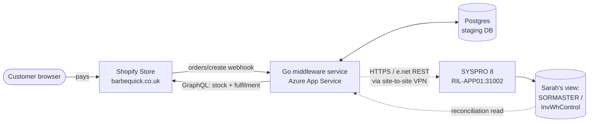
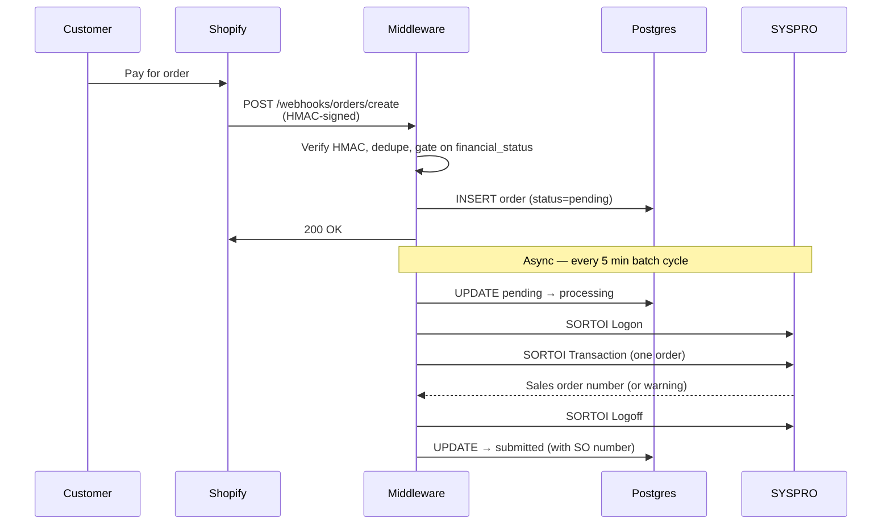
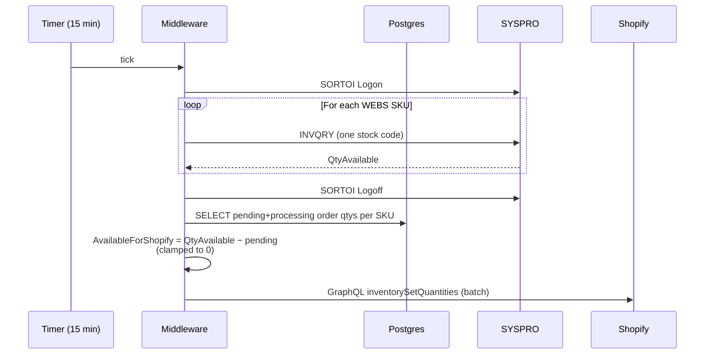
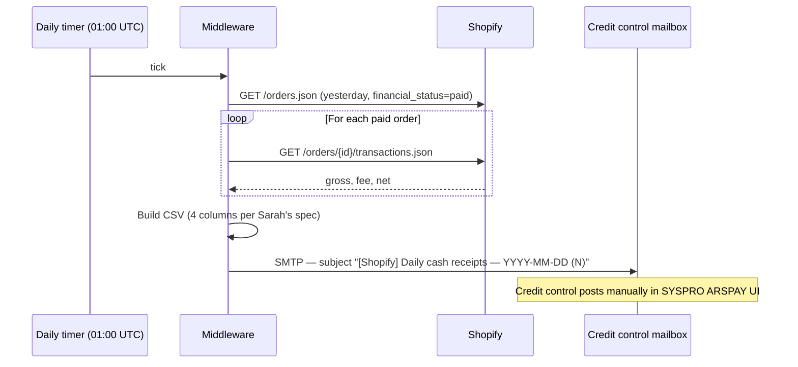

# Rectella Shopify Service — Handover Document

**Project:** Shopify ↔ SYSPRO 8 integration for Barbequick (`barbequick.co.uk`)
**Delivered by:** Ctrl Alt Insight (Sarah Adamo, Sebastian Adamo)
**For:** Rectella International — Operations (Melanie Higgins, Reece Taylor), Finance (Liz Buckley), and IT (Andrew Wilson, NCS)
**Status:** Phase 1 LIVE on bridge infrastructure, processing real customer orders. Phase 2 cloud migration in progress.

---

## 1. What we built

A middleware service that sits between the Barbequick Shopify storefront and SYSPRO 8 ERP, automating three previously-manual workflows:

| # | Topic | Direction | Trigger | Business object |
|---|-------|-----------|---------|-----------------|
| 1 | **Order entry** | Shopify → SYSPRO | Webhook on customer payment | `SORTOI` |
| 2 | **Quantity on hand** | SYSPRO → Shopify | Polled every 15 minutes | `INVQRY` |
| 3 | **Cash receipts** | Shopify → credit control | Daily email at 01:00 UTC | (manual posting in SYSPRO ARSPAY UI) |

A fourth flow (**fulfilment back**: SYSPRO `SORQRY` → Shopify shipped status, every 30 minutes) is also live but is largely a by-product of the first three.

---

## 2. High-level architecture



**Key design choices:**

- **Stage-then-process**: every Shopify webhook lands in Postgres first. SYSPRO is only ever called by an asynchronous batch worker. If SYSPRO is unreachable, orders queue safely until the VPN is back.
- **Single SYSPRO customer**: every order posts to `WEBS01`. No per-customer accounts.
- **Single warehouse**: stock and fulfilment use `WEBS` only.
- **Shopify owns pricing**: SYSPRO prices are not synced to Shopify. The middleware honours whatever the customer paid (net of VAT — see §6).
- **Idempotent at every boundary**: webhooks are deduplicated on Shopify's `X-Shopify-Webhook-Id`; SYSPRO orders are deduplicated on Shopify order ID; cash receipts are deduplicated on Shopify transaction ID.

---

## 3. Topic 1 — Order entry (Shopify → SYSPRO)

### 3.1 Flow



### 3.2 What gets sent to SYSPRO

For each Shopify order, one `SORTOI` transaction containing:

| SYSPRO field | Shopify source | Notes |
|--------------|---------------|-------|
| `Customer` | (fixed) `WEBS01` | Single web-sales account |
| `CustomerPoNumber` | `order.name` (e.g. `#BBQ1010`) | **The cross-match key** between Shopify and SYSPRO |
| `OrderDate`, `RequestedShipDate` | `created_at` | RFC3339 |
| `ShipAddress1..5`, `ShipPostalCode` | `shipping_address.*` | Truncated to SYSPRO XSD limits (40/15 chars) |
| `StockCode` | `line_items[].sku` | Must exactly match a SYSPRO stock code |
| `OrderQty` | `line_items[].quantity` | |
| `Price` | `line_items[].price` minus per-line tax | **Net of VAT** (see §6) |
| `StockTaxCode` | derived from `tax_lines[].rate` | `A` (20%) / `B` (5%) / `Z` (0%) |
| `FreightValue`, `FreightCost` | `shipping_lines[].price` minus tax | Net of shipping VAT |

### 3.3 Order statuses (in our DB)

```
pending    → in queue, waiting for the next 5-minute batch
processing → batch in flight to SYSPRO (atomic transition prevents double-submit)
submitted  → SYSPRO accepted, sales order number recorded
failed     → SYSPRO rejected (business error, e.g. invalid SKU)
dead_letter→ 3+ infrastructure failures (escalate)
fulfilled  → SYSPRO marked complete, Shopify fulfilment created
cancelled  → cancelled by Shopify (Phase 2 will propagate to SYSPRO)
```

### 3.4 Failure handling

- **Business errors** (bad SKU, missing customer): order marked `failed`, batch continues with the next order.
- **Infrastructure errors** (VPN down, SYSPRO 5xx): batch aborts cleanly, retries next cycle. After 3 infrastructure failures the order moves to `dead_letter`.
- **Crash during submit**: a startup sweep flips orders stuck in `processing` for >10 minutes back to `pending`.
- **Missed webhook**: a reconciliation sweeper polls Shopify Admin REST every 15 minutes (48 h lookback) and re-stages anything that exists in Shopify but not in our DB.

---

## 4. Topic 2 — Quantity on hand (SYSPRO → Shopify)

### 4.1 Flow



### 4.2 Behaviour rules

- **Order-aware**: pending and processing orders are subtracted from SYSPRO `QtyAvailable` before pushing to Shopify, so the same unit isn't oversold while it's in transit to SYSPRO.
- **Negative clamp**: if pending orders exceed SYSPRO availability, Shopify is set to 0 (never negative).
- **Zero-push rule** (Sarah's rule): if a SKU is **not** present on the WEBS warehouse in SYSPRO, Shopify is set to 0. This prevents accidentally selling something Rectella doesn't stock.
- **Failure-safe**: if SYSPRO is unreachable, Shopify is **not** zeroed. Last-known levels stay on the storefront.
- **Webhook-triggered sync**: every order also fires a 2-second debounced sync, so heavy buying activity doesn't depend on the 15-minute timer.

### 4.3 SKU discovery

Lister precedence (first one configured wins):

1. **SQL Server view** (`bq_WEBS_Whs_QoH` on RIL-DB01) — Sarah's curated list. Currently blocked on RIL-DB01 credentials for the service account.
2. **Shopify GraphQL** — paginated `productVariants` query — every variant SKU on the live store.
3. **Static slice** — `SYSPRO_SKUS` env var, comma-separated.

---

## 5. Topic 3 — Cash receipts (daily report to credit control)

### 5.1 Agreed approach for Phase 1 (per Sarah, 2026-04-17)

Cash receipts are handled by a **daily email** to Rectella's credit control mailbox at **01:00 UK time**, containing the prior day's settled Shopify transactions as a CSV. Credit control posts the receipts manually in SYSPRO (Sales / AR → ARSPAY) against the WEBS01 customer account, using the Shopify order reference as the payment reference.

> **Phase 2 note:** automated posting via SYSPRO's AR cash-receipt business object (`ARSTPY`) is **not viable on Rectella's current SYSPRO licence** — the business object is not registered in this environment. We will investigate full automation in **Phase 2 once Rectella has moved to the new licensing model** that includes the AR transaction posting business objects.

### 5.2 Flow



### 5.3 CSV format (per Sarah, 2026-04-17)

Four columns, one row per settled Shopify transaction for the prior calendar day (UTC). Currency values prefixed with `£`.

| Column | Meaning |
|--------|---------|
| `Shopify Reference` | Shopify order name (e.g. `#BBQ1001`) — use as payment reference in SYSPRO ARSPAY UI |
| `Order Value` | Gross — what the customer paid (post into the `Amount` field) |
| `Charges` | Bank / Stripe fee (post into the `Bank charges` field) |
| `Receipt Value` | Order Value − Charges — the figure that hits the cashbook |

**Example row:** `#BBQ1001,£8.00,£1.12,£6.88`

The email body also summarises gross/fee/net/count in plain text so credit control can sanity-check totals without opening the attachment.

### 5.4 Operating prerequisites

| Item | Owner | Notes |
|------|-------|-------|
| `SMTP_HOST`, `SMTP_PORT` | Andrew (NCS) / Rectella IT | e.g. `smtp.office365.com:587` |
| `SMTP_USERNAME`, `SMTP_PASSWORD` | Andrew | For STARTTLS auth (SMTP_USE_TLS=true) |
| `SMTP_FROM` | Rectella | Envelope-from address (e.g. `noreply@rectella.com` or the ctrlaltinsight@rectella.com service mailbox) |
| `CREDIT_CONTROL_TO` | Liz | Comma-separated recipient list (e.g. Liz + credit-control inbox) |
| `DAILY_REPORT_HOUR` | Operator | UTC hour 0–23, default `1` (≈ 01:00 GMT / 02:00 BST) |

If any required SMTP / recipient field is missing the daily reporter is disabled gracefully and a warning is logged — the service refuses to half-configure mail.

### 5.5 Why not full automation in Phase 1

Two reasons:

1. **SYSPRO licensing**: the `ARSTPY` business object (the e.net DLL that posts AR cash receipts) is not present on Rectella's current SYSPRO install — calling it returns `e.net exception 100000`. This is a license-tier limitation, not a configuration bug. Adding the business object requires Rectella to upgrade their SYSPRO licence.
2. **Finance sign-off**: Liz needs to validate the GL routing (cashbook, bank-charges account) and posting cadence on real receipts before automation goes live, regardless of licensing. The daily report gives her exactly the data she needs to do that validation in parallel with everything else this Phase 1 launch is asking of her.

The daily report is the right Phase 1 design even with full licensing, because it lets Liz keep cash posting under human control while the integration earns trust.

### 5.6 Phase 2 — what changes when licensing is upgraded

When Rectella moves to a SYSPRO licence that includes the AR transaction business objects, Phase 2 swaps the "manual posting from CSV" step for an automated `ARSTPY` polling syncer that runs every 15 minutes, posts gross + bank charges per Shopify order, and uses the Shopify order name as the payment reference. The daily report can stay enabled in parallel as an audit trail.

The middleware codebase already contains the scaffolding (`internal/syspro/cash_receipt.go`, `internal/payments/syncer.go`, `cmd/arspaytest/`) for that Phase 2 path — gated behind `PAYMENTS_SYNC_INTERVAL` + `ARSPAY_CASH_BOOK` + `ARSPAY_PAYMENT_TYPE` env vars, all unset in Phase 1.

---

## 6. Pricing & VAT — assumptions baked in

The Barbequick storefront sells with `taxes_included = true` (UK B2C standard — prices on the website are gross). SYSPRO 8 expects net prices, so the middleware:

1. **Subtracts the absolute per-line tax amount** Shopify provides in `line_items[].tax_lines[].price` from the gross line price. We do **not** divide by a rate — the absolute subtraction matches Shopify's own rounding to the penny.
2. **Sets `<StockTaxCode>` per line** based on `tax_lines[].rate`:
   - `0.20` → `A` (UK standard 20%)
   - `0.05` → `B` (reduced 5% — domestic fuel)
   - `0.00` → `Z` (zero-rated)
3. **Treats freight identically**: `<FreightValue>` is net of shipping VAT.

This requires **"Allow changes to tax code for stocked items"** to be enabled in SYSPRO Sales Order Setup → Tax/Um tab. Sarah enabled this on the live `RIL` company.

If the storefront is ever switched to `taxes_included = false` (exclusive pricing), the middleware leaves prices untouched. No code change required.

---

## 7. Other operating assumptions

| # | Assumption | Why it matters |
|---|------------|----------------|
| 1 | Stock sync polls every **15 minutes** | Tunable via `STOCK_SYNC_INTERVAL`. A live order also fires a 2-second debounced sync, so 15 min is a safety net not a deadline. |
| 2 | Order batch cycle every **5 minutes** | Orders sit in `pending` for ≤5 min before reaching SYSPRO. Tunable via `BATCH_INTERVAL`. |
| 3 | Fulfilment poll every **30 minutes** | Tunable via `FULFILMENT_SYNC_INTERVAL`. Customer-facing impact is the dispatch email timing. |
| 4 | Reconciliation sweep every **15 minutes**, **48 h lookback** | Catches missed webhooks. First sweep runs immediately on service restart. |
| 5 | Single SYSPRO operator account | SYSPRO allows only one session per operator. The service uses a mutex internally so its sub-systems share one session. **A human logging in with the same operator will evict the service.** Reece is creating a dedicated operator account. |
| 6 | Single warehouse `WEBS`, single customer `WEBS01` | Hardcoded — multi-warehouse is out of scope. |
| 7 | UK GBP only | No multi-currency logic. |
| 8 | Refunds posted manually | The service does not write refunds back to SYSPRO. |
| 9 | Gift cards disabled on Shopify | Pending Liz sign-off on the non-stocked-line + GL liability approach. |
| 10 | Cancellation classify-only (Phase 1) | Cancelled Shopify orders are categorised but **not** propagated to SYSPRO automatically. Operator follow-up required. |

---

## 8. What happens when something stops working

Detailed playbooks live in [`docs/runbook.md`](runbook.md). The summary view:

| Symptom | Customer impact | Recovery path |
|---------|-----------------|---------------|
| **VPN tunnel down** | None initially. Orders queue in Postgres. | NCS restores tunnel; batch processor drains queue automatically within one cycle. |
| **SYSPRO down / unreachable** | Same as above. | Same as above. |
| **Shopify webhook not delivered** | Order missing from SYSPRO. | Reconciliation sweeper picks it up within 15 min (48 h lookback). Restart forces an immediate sweep. |
| **Service crashes mid-submit** | Order may show `processing` indefinitely. | Startup sweep flips `processing` >10 min back to `pending`. |
| **Postgres down** | Webhooks rejected with 5xx; Shopify retries for 48 h. | Restore Postgres; Shopify retry cycle covers the gap. |
| **Wrong webhook secret** | All webhooks 401. | Update `SHOPIFY_WEBHOOK_SECRET`; Shopify retries within 48 h. |
| **Stock figures wrong on storefront** | Possible oversell of one or two units between cycles. | Next 15-min cycle corrects it; or trigger immediately by placing any order. |
| **SYSPRO operator session evicted by human login** | Batch and stock-sync errors until next cycle. | Either: human logs out, or service waits ≤5 min and retries. Reece's dedicated operator account eliminates this. |

The full per-incident triage steps (commands to run, what to look for in logs, who to escalate to) live in the runbook.

---

## 9. The intake-comparison report (Sarah's offer)

> *"What happens if it stops working — the report that compares order intake (Shopify) to order intake (SYSPRO). I can create a view for the SYSPRO side if that helps."*

This is the daily/weekly assurance report Finance and Operations should run to **prove** the integration is whole. Sarah's offer to expose a SYSPRO-side view is exactly the right shape.

### 9.1 What the report compares

For a chosen date range, three datasets:

1. **Shopify** — orders with `financial_status` in (`paid`, `partially_paid`).
2. **Middleware DB** — orders with status in (`submitted`, `fulfilled`).
3. **SYSPRO** — sales orders against `WEBS01`, joined on `CustomerPoNumber` (which equals the Shopify `order.name`, e.g. `#BBQ1010`).

### 9.2 Suggested SYSPRO view shape

What the middleware needs from Sarah's view (call it e.g. `bq_WEBS_Orders_View`):

| Column | Type | Source |
|--------|------|--------|
| `SalesOrder` | string | `SorMaster.SalesOrder` |
| `CustomerPoNumber` | string | `SorMaster.CustomerPoNumber` (this is `#BBQXXXX`) |
| `Customer` | string | `SorMaster.Customer` (always `WEBS01`) |
| `OrderDate` | datetime | `SorMaster.OrderDate` |
| `OrderStatus` | char | `SorMaster.OrderStatus` (1–9 SYSPRO state) |
| `OrderValueGross` | decimal | `SorMaster.OrderValueGross` |
| `OrderValueTax` | decimal | `SorMaster.OrderValueTax` |
| `LineCount` | int | count from `SorDetail` |
| `WarehouseCode` | string | `SorDetail.Warehouse` (always `WEBS` — useful for sanity) |

Filter to `WHERE Customer = 'WEBS01' AND CustomerPoNumber LIKE '#BBQ%'`. SQL Server view (live SQL) is preferred over a SYSPRO custom form export.

### 9.3 Output (per row)

| Shopify ref | Date | Shopify total | SYSPRO total | SYSPRO SO# | Match status |
|-------------|------|---------------|--------------|------------|--------------|
| `#BBQ1010` | 2026-04-17 | £119.99 | £99.99 | 015575 | ✅ matched (totals net of VAT differ as expected) |
| `#BBQ1011` | 2026-04-17 | £45.00 | — | — | ❌ **MISSING IN SYSPRO** |
| `#BBQ1012` | 2026-04-17 | — | £200.00 | 015576 | ⚠️ **MISSING IN SHOPIFY** (test order?) |

### 9.4 Implementation note

A CLI tool can ship in `cmd/intake-report/` — single command that takes a date range, queries all three sources, writes a CSV (and optionally emails it). Estimated effort: half a day once Sarah's view is in place.

---

## 10. Operating handover

| Item | Where to find it |
|------|------------------|
| Day-to-day operator runbook | [`docs/runbook.md`](runbook.md) |
| Architecture diagrams (interactive) | [`docs/architecture-playground.html`](architecture-playground.html) |
| Architecture diagrams (durable ASCII) | [`docs/architecture-diagrams.md`](architecture-diagrams.md) |
| Network setup (VPN, firewalls, hosts) | [`docs/network-setup.md`](network-setup.md) |
| SYSPRO config requirements (per-line tax codes etc.) | [`docs/SYSPRO 8 SORTOI Per-Line Tax Code Override.md`](SYSPRO%208%20SORTOI%20Per-Line%20Tax%20Code%20Override.md) |

### Escalation contacts

| Role | Name | Email |
|------|------|-------|
| Developer | Sebastian Adamo (Ctrl Alt Insight) | sebastian@ctrlaltinsight.co.uk |
| SYSPRO consultant | Sarah Adamo (Ctrl Alt Insight) | sarah@ctrlaltinsight.co.uk |
| SYSPRO admin (Rectella) | Melanie Higgins | higginsm@rectella.com |
| SYSPRO admin (Rectella) | Reece Taylor | taylorr@rectella.com |
| Finance Director (Rectella) | Liz Buckley | buckleyl@rectella.com |
| Managed IT | NCS (Ross Tomlinson) | helpdesk@ncs.cloud |

---

## 11. Phase boundaries

### What is in Phase 1 (delivered)

- Order entry (Shopify → SORTOI), with VAT strip and per-line tax code override
- Stock sync (SYSPRO → Shopify), order-aware, zero-push for missing SKUs
- Fulfilment back (SYSPRO → Shopify dispatch status)
- Reconciliation sweeper (catches missed webhooks)
- Cancellation classification (categorises cancelled Shopify orders into 6 dispositions; **does not** propagate to SYSPRO)
- Daily cash-receipt CSV email (configurable; bridges the gap until ARSPAY is automated)
- Operator runbook
- Live monitoring (external uptime check + push notification)

### What is **not** in Phase 1

- Automatic Shopify-cancellation → SYSPRO cancellation propagation
- Gift cards — pending Liz sign-off on GL approach
- Returns / refunds — handled manually
- Multi-warehouse / multi-customer / multi-currency
- ERP-to-Shopify pricing sync

### Phase 2 candidates (commercial)

- Cancellation propagation to SYSPRO
- Gift card support
- Refund handling
- GDPR retention policy (90-day NULL of `raw_payload`)
- Intake-reconciliation report (per §9)

---

## 12. Sign-off checklist

For Rectella to consider Phase 1 complete, confirm:

- [ ] Operator runbook reviewed and approved by Melanie / Reece
- [ ] Three integrations (order, stock, fulfilment) running on production infrastructure
- [ ] Reconciliation sweeper enabled (`RECONCILIATION_INTERVAL=15m`)
- [ ] Daily CSV cash-receipt email (or ARSPAY automation if delivered) reaching credit control
- [ ] Intake-comparison report agreed and Sarah's view in place
- [ ] Escalation contacts circulated to Rectella ops

---

*This document covers the state of the integration as of 2026-04-17. For amendments, contact Sebastian.*
